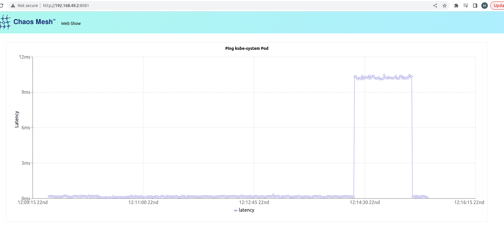

# WIP

### Why do we need chaos-mesh?

To have more robust and reliable systems by identifying weaknesses and vulnerabilities in applications and infrastructure by simulating real-world failures.

### What is chaos-mesh?

A Powerful Chaos Engineering Platform for Kubernetes (1*)

### Precondition

- Kubernetes Cluster
  - minikube (installation)
     - ```curl -LO https://storage.googleapis.com/minikube/releases/latest/minikube-linux-amd64```
     - ```sudo install minikube-linux-amd64 /usr/local/bin/minikube```
  - ```minikube start --memory 4096 --cpus 4 --kubernetes-version v1.25.14```
 
- Support Status of Chaos Mesh -> https://chaos-mesh.org/supported-releases/

### Installation (2*)

```curl -sSL https://mirrors.chaos-mesh.org/v2.6.2/install.sh | bash``` 

- Verify the installation
```kubectl get po -n chaos-mesh```

```
kubectl get po -n chaos-mesh
NAME                                        READY   STATUS    RESTARTS   AGE
chaos-controller-manager-85bbfb4465-ldt2s   1/1     Running   0          24m
chaos-controller-manager-85bbfb4465-nf7lf   1/1     Running   0          24m
chaos-controller-manager-85bbfb4465-s4jsg   1/1     Running   0          24m
chaos-daemon-8txlg                          1/1     Running   0          24m
chaos-dashboard-68f7cb885f-rtczf            1/1     Running   0          24m
chaos-dns-server-55bd597564-bqv9v           1/1     Running   0          24m
```

### Test (Chaos Experiments)

#### 0. Create example pods
- ```kubectl apply -f example-01-deployment.yaml```

-  ```curl -sSL https://mirrors.chaos-mesh.org/latest/web-show/deploy.sh | bash```

#### 1. Simulate Pod Faults
- Pod Kill

  - ```kubectl apply -f ./pod-kill.yaml```

  - 2 Pods will be deleted every minute randomly.


#### 2. Simulate Network Delay
  
  - ```kubectl port-forward  svc/web-show 8081:8081```

  - ```kubectl apply -f network-delay.yaml```

  - ```kubectl delete -f network-delay.yaml```

To access the Web Show application visit ```${NodeIP}:8081``` via your browser.

  

 #### 3. Simulate Stress Scenarios  (4*)

  - ```minikube addons enable metrics-server``` 

```
kubectl top pods
NAME                            CPU(cores)   MEMORY(bytes)   
deploy-app-1-7f5f6d9dd-cs52l    1m           7Mi             
deploy-app-1-7f5f6d9dd-ksmvh    1m           7Mi             
deploy-app-1-7f5f6d9dd-nwp5g    1m           7Mi             
deploy-app-1-7f5f6d9dd-wqc7m    1m           7Mi             
web-show-868b74c6fc-dr6xv       2m           11Mi      
```

  - ```kubectl apply -f memory-stress.yaml``` 

  - ```kubectl top pod```

    - 
       ``` 
       kubectl top pods
       NAME                           CPU(cores)   MEMORY(bytes)   
       deploy-app-1-7f5f6d9dd-cs52l   1m           7Mi             
       deploy-app-1-7f5f6d9dd-ksmvh   1m           7Mi              
       deploy-app-1-7f5f6d9dd-nwp5g   3m           256Mi           
       deploy-app-1-7f5f6d9dd-wqc7m   1m           7Mi             
       web-show-868b74c6fc-dr6xv      1m           11Mi    
       ```

### Uninstall chaos-mesh
```kubectl delete ns chaos-mesh```

### Resources
1*. https://chaos-mesh.org/

2*. https://chaos-mesh.org/docs/quick-start/

3* https://chaos-mesh.org/blog/deploy-chaos-mesh-on-kubesphere/

4* https://chaos-mesh.org/docs/simulate-heavy-stress-on-kubernetes/